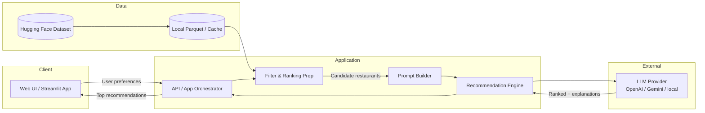
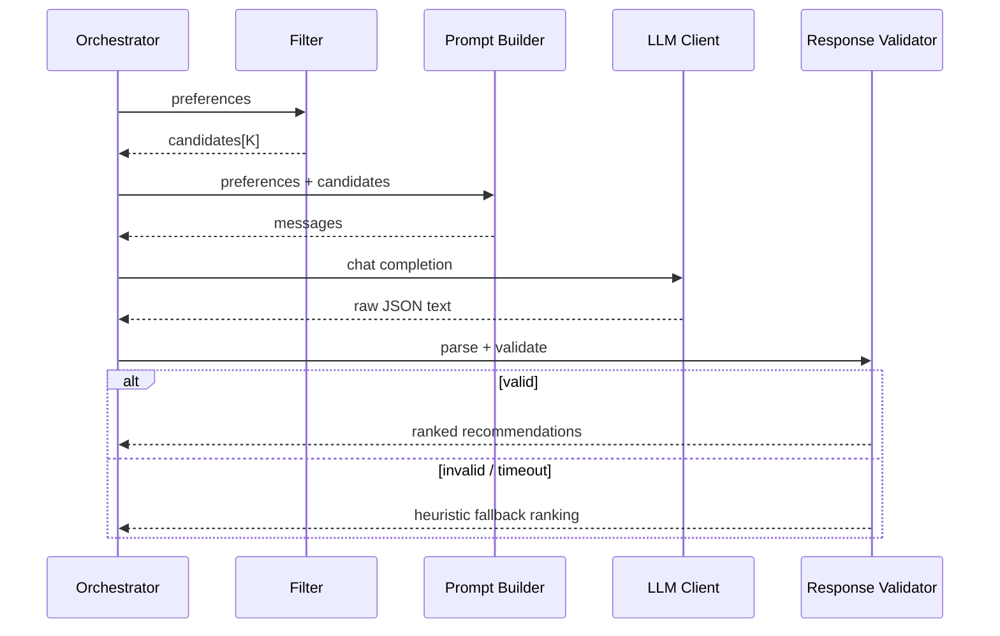
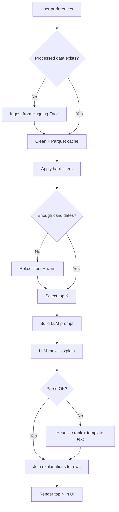

# Architecture: AI-Powered Restaurant Recommendation System

This document defines the system architecture for building the Zomato-inspired restaurant recommendation service described in [`problemStatement.md`](./problemStatement.md). It covers components, data flow, technology choices, prompt design, and a recommended project layout.

---

## 1. Overview

The system combines **deterministic filtering** over a real Zomato restaurant dataset with an **LLM-based ranking and explanation layer**. Structured preferences (location, budget, cuisine, rating) narrow candidates first; the LLM then ranks those candidates and produces human-readable justifications.

| Concern | Approach |
| --- | --- |
| Data source | Hugging Face dataset `ManikaSaini/zomato-restaurant-recommendation` (~51k Bangalore restaurants) |
| Hard constraints | Rule-based filters (location, cost band, cuisine, min rating) |
| Soft preferences | LLM reasoning (family-friendly, quick service, vibe, etc.) |
| Output | Top-N ranked restaurants with name, cuisine, rating, cost, and AI explanation |

**Design principle:** Never send the full dataset to the LLM. Filter first, then prompt with a small candidate set (e.g., 10–20 rows) so recommendations stay grounded, cheap, and fast.

---

## 2. High-Level Architecture



### Request lifecycle

1. User submits preferences in the UI.
2. Orchestrator validates input and loads (or reuses) preprocessed restaurant data.
3. Filter layer applies hard constraints and returns a short candidate list.
4. Prompt builder serializes candidates + preferences into a structured LLM prompt.
5. Recommendation engine calls the LLM, parses the response, and maps ranks back to restaurant records.
6. UI renders top recommendations with AI-generated explanations.

---

## 3. Recommended Tech Stack

| Layer | Choice | Rationale |
| --- | --- | --- |
| Language | Python 3.11+ | Best ecosystem for data + LLM apps |
| Data loading | `datasets` (Hugging Face) + `pandas` | Direct HF access; familiar tabular ops |
| Persistence / cache | Local Parquet (`data/processed/restaurants.parquet`) | Avoid re-downloading 574 MB on every run |
| App UI | Streamlit (MVP) or FastAPI + simple frontend | Fast to ship; Streamlit fits workshop demos |
| LLM | OpenAI API, Google Gemini, or Ollama (local) | Swappable behind a thin client interface |
| Config / secrets | `.env` + `python-dotenv` | Keep API keys out of source |
| Validation | Pydantic models | Typed preferences + LLM response schemas |

**MVP recommendation:** Streamlit + pandas + one LLM provider. Add FastAPI later if you need a separate API for mobile/web clients.

---

## 4. Component Design

### 4.1 Data Ingestion Module

**Responsibility:** Load the HF dataset once, clean/normalize fields, and persist a lean working table.

**Dataset fields (source):**

| Field | Use in system |
| --- | --- |
| `name` | Display |
| `location` | Location filter (area, e.g. Banashankari) |
| `listed_in(city)` | Broader city/area grouping |
| `cuisines` | Cuisine filter (comma-separated) |
| `approx_cost(for two people)` | Budget mapping |
| `rate` | Rating filter (e.g. `4.1/5`) |
| `votes` | Popularity signal for pre-ranking |
| `rest_type` | Soft preference (Quick Bites, Casual Dining, Cafe) |
| `dish_liked` | Soft preference / explanation context |
| `online_order`, `book_table` | Soft preference signals |
| `reviews_list` | Optional truncated snippets for richer LLM context |
| `address`, `url` | Display / deep link |
| `menu_item`, `phone` | Optional; usually excluded from prompts to save tokens |

**Preprocessing steps:**

1. Load HF dataset (`load_dataset(...)`).
2. Drop or ignore heavy unused columns for the MVP (`menu_item` full dumps when empty/noisy).
3. Parse `rate` → numeric `rating` (handle `"NEW"`, `"-"`, missing).
4. Parse `approx_cost(for two people)` → numeric `cost_for_two` (strip commas).
5. Normalize `cuisines` into a list or searchable lowercase string.
6. Deduplicate restaurants if the same `name` + `address` appears multiple times (dataset has overlapping listings).
7. Derive `budget_band`:
   - **low:** cost ≤ 400
   - **medium:** 401–800
   - **high:** > 800  
   *(Tune thresholds after inspecting cost distribution.)*
8. Save cleaned Parquet + a small metadata JSON (row count, unique locations, cuisine vocabulary).

**Outputs:**

- `data/processed/restaurants.parquet`
- `data/processed/metadata.json`

---

### 4.2 User Input Module

**Responsibility:** Collect and validate preference payloads.

**Preference schema:**

```json
{
  "location": "Banashankari",
  "budget": "medium",
  "cuisine": "Italian",
  "min_rating": 4.0,
  "additional_preferences": "family-friendly, quiet ambience",
  "top_n": 5
}
```

**UI controls (suggested):**

| Preference | Control |
| --- | --- |
| Location | Dropdown from unique `location` / `listed_in(city)` values |
| Budget | Radio / select: low · medium · high |
| Cuisine | Select or multi-select from cuisine vocabulary |
| Min rating | Slider (e.g. 3.0–5.0) |
| Additional preferences | Free-text |
| Top N | Number input (default 5) |

Validate with Pydantic before filtering. Empty optional fields should be allowed; require at least location **or** cuisine for a meaningful query.

---

### 4.3 Integration / Filter Layer

**Responsibility:** Apply hard filters so the LLM only sees relevant candidates.

**Filter pipeline (ordered):**

```text
raw table
  → location match (case-insensitive contains / exact on known areas)
  → cuisine match (substring in cuisines)
  → budget_band match
  → rating >= min_rating
  → optional rest_type heuristics from free-text (e.g. "quick" → Quick Bites)
  → sort by rating, then votes
  → take top K candidates (default K = 15)
```

**Fallback strategy:**

| Situation | Behavior |
| --- | --- |
| 0 matches | Relax least-critical filter (budget first, then rating); surface a UI notice |
| < 3 matches | Proceed with what exists; ask LLM to note limited options |
| > K matches | Keep top K by rating × popularity |

**Candidate payload for LLM (per restaurant):**

```json
{
  "id": 12,
  "name": "Onesta",
  "location": "Banashankari",
  "cuisines": "Pizza, Cafe, Italian",
  "rating": 4.6,
  "votes": 2556,
  "cost_for_two": 600,
  "rest_type": "Casual Dining, Cafe",
  "dish_liked": "Farmhouse Pizza, Chocolate Banana, Virgin Mojito",
  "online_order": "Yes",
  "book_table": "Yes"
}
```

Do **not** dump full `reviews_list` by default (can be huge). Optionally attach 1–2 short review snippets if token budget allows.

---

### 4.4 Prompt Builder

**Responsibility:** Construct system + user messages that force structured, grounded output.

**System prompt goals:**

- Act as a restaurant recommendation assistant for Zomato-style Bangalore data.
- Rank **only** from the provided candidate list (no inventing restaurants).
- Explain why each pick fits the user’s preferences.
- Return machine-parseable JSON.

**User prompt contents:**

1. Serialized user preferences
2. Candidate restaurant JSON array
3. Output schema instructions
4. Constraints: `top_n`, no hallucinated names/costs, cite matching attributes

**Example output schema the LLM must return:**

```json
{
  "summary": "Short overview of the recommendation set",
  "recommendations": [
    {
      "id": 12,
      "rank": 1,
      "name": "Onesta",
      "explanation": "Strong Italian/Pizza match, high rating (4.6), mid-range cost for two, popular with families."
    }
  ]
}
```

---

### 4.5 Recommendation Engine

**Responsibility:** Call the LLM, parse/validate response, join explanations onto restaurant rows, and degrade gracefully on failures.



**LLM client interface (provider-agnostic):**

```python
class LLMClient(Protocol):
    def complete(self, messages: list[dict], *, temperature: float = 0.2) -> str: ...
```

**Fallback (no LLM / parse failure):**

- Rank candidates by `(rating, votes)`.
- Generate template explanations:  
  `"{name} matches {cuisine} in {location} with rating {rating} and approx cost ₹{cost}."`

This keeps the app usable offline or when API keys are missing.

---

### 4.6 Output / Presentation Layer

**Responsibility:** Show clear, useful results.

**Per recommendation card:**

| Field | Source |
| --- | --- |
| Restaurant Name | dataset / LLM (verified by `id`) |
| Cuisine | dataset |
| Rating | dataset |
| Estimated Cost | dataset (`cost_for_two`) |
| AI explanation | LLM |
| Optional extras | address, online order, book table, Zomato URL |

Also show:

- A short **summary** from the LLM
- Filter metadata (“15 candidates → top 5”)
- Empty / relaxed-filter messaging when applicable

---

## 5. Application Topology (MVP)

### Option A — Streamlit monolith (recommended for workshop)

```text
User → Streamlit pages/widgets
         → services/recommend.py (orchestrator)
           → data + filter + prompt + llm
         → render cards
```

Single process, minimal ops, ideal for demos.

### Option B — API + UI (if extending later)

```text
Client UI ──HTTP──▶ FastAPI
                      /health
                      /meta/locations
                      /meta/cuisines
                      /recommend  (POST preferences)
```

Keep the same service layer so Streamlit and FastAPI can share code.

---

## 6. Proposed Project Structure

```text
Zomato-M7/
├── docs/
│   ├── problemStatement.md
│   └── architecture.md
├── data/
│   ├── raw/                      # optional local HF snapshot
│   └── processed/
│       ├── restaurants.parquet
│       └── metadata.json
├── src/
│   └── zomato_rec/
│       ├── __init__.py
│       ├── config.py             # env, paths, budget thresholds, top_k
│       ├── models.py             # Pydantic: Preferences, Recommendation
│       ├── data/
│       │   ├── ingest.py         # HF load + preprocess + save
│       │   └── repository.py     # load parquet, query helpers
│       ├── filtering/
│       │   └── filters.py        # hard filters + candidate selection
│       ├── llm/
│       │   ├── client.py         # provider adapter
│       │   ├── prompts.py        # system/user prompt templates
│       │   └── parser.py         # JSON extract + validate
│       ├── services/
│       │   └── recommend.py      # end-to-end orchestration
│       └── app/
│           └── streamlit_app.py  # UI entrypoint
├── scripts/
│   └── prepare_dataset.py        # one-shot ingestion CLI
├── tests/
│   ├── test_filters.py
│   ├── test_prompt_parser.py
│   └── test_recommend_fallback.py
├── .env.example
├── requirements.txt
└── README.md
```

---

## 7. Configuration

| Variable | Purpose |
| --- | --- |
| `LLM_PROVIDER` | `openai` \| `gemini` \| `ollama` |
| `LLM_API_KEY` | Provider API key |
| `LLM_MODEL` | e.g. `gpt-4o-mini`, `gemini-1.5-flash` |
| `DATA_PATH` | Path to processed Parquet |
| `CANDIDATE_K` | Max restaurants sent to LLM (default 15) |
| `DEFAULT_TOP_N` | Recommendations shown (default 5) |
| `BUDGET_LOW_MAX` / `BUDGET_MED_MAX` | Cost band thresholds |

---

## 8. Data Flow (End-to-End)



---

## 9. Non-Functional Requirements

| Area | Guidance |
| --- | --- |
| Latency | Target &lt; 5–8s per recommendation (filter ms + LLM seconds) |
| Cost | Cap candidates (`K≤20`); use a small/cheap model for MVP |
| Grounding | Always bind LLM output to candidate `id`; drop unknown names |
| Privacy | No PII in dataset path; don’t log full prompts with keys |
| Reliability | Timeout + retry once; always keep heuristic fallback |
| Observability | Log preference hash, candidate count, latency, parse success |
| Reproducibility | Pin dataset revision; version processed Parquet schema |

---

## 10. Security & Safety Notes

- Store secrets only in `.env` (never commit).
- Treat LLM output as untrusted: validate JSON schema; escape HTML if rendering in a web view.
- Truncate free-text `additional_preferences` (e.g. 300 chars) to reduce prompt-injection surface.
- Instruct the model not to follow instructions embedded inside restaurant review text if reviews are included.

---

## 11. Testing Strategy

| Layer | What to test |
| --- | --- |
| Ingestion | Rating/cost parsers; budget banding; null handling |
| Filters | Location/cuisine/budget/rating combinations; empty results; relaxation |
| Parser | Valid JSON, markdown-fenced JSON, missing fields, hallucinated ids |
| Service | Happy path with mocked LLM; fallback path when LLM fails |
| UI smoke | Form submit → cards render (manual or Streamlit testing) |

---

## 12. Implementation Phases

### Phase 1 — Data foundation
- Ingestion script, Parquet cache, metadata for dropdowns
- Unit tests for parsers/filters

### Phase 2 — Core recommend path
- Filter layer + prompt templates + LLM client + orchestrator
- CLI or notebook demo of end-to-end recommend

### Phase 3 — User experience
- Streamlit UI for preferences and recommendation cards
- Empty states, loading spinner, relaxed-filter notices

### Phase 4 — Hardening
- Response validation, fallbacks, logging, `.env.example`, README
- Optional FastAPI wrapper / provider switch

---

## 13. Key Architectural Decisions

1. **Hybrid retrieval + generation:** Rules retrieve; LLM ranks/explains. This is cheaper and more factual than pure RAG over 51k rows for an MVP.
2. **Cache locally after first HF download:** Workshop iterations should not depend on repeated large downloads.
3. **ID-grounded LLM output:** Explanations attach to known restaurant ids to prevent invented venues.
4. **Provider-agnostic LLM port:** Swap OpenAI/Gemini/Ollama without rewriting the pipeline.
5. **Graceful degradation:** App remains useful with template rankings if the LLM is unavailable.

---

## 14. Out of Scope (MVP)

- Live Zomato API / real-time availability
- User accounts, history, collaborative filtering
- Geospatial distance / maps
- Fine-tuning a custom model
- Multi-city datasets beyond what the HF dump provides (primarily Bangalore localities)

These can be future extensions once the hybrid filter + LLM loop is solid.

---

## 15. Success Criteria

The architecture is successfully realized when a user can:

1. Select location, budget, cuisine, and minimum rating
2. Optionally add free-text preferences
3. Receive top-N restaurants with cuisine, rating, cost, and coherent AI explanations
4. See only restaurants that exist in the filtered candidate set
5. Still get reasonable results if the LLM call fails
