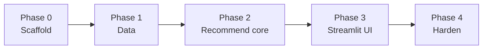

# Implementation Plan: AI-Powered Restaurant Recommendation System

Phase-wise plan for building the Zomato-inspired recommendation service defined in [`problemStatement.md`](./problemStatement.md) and designed in [`architecture.md`](./architecture.md).

**Design principle:** Filter the ~51k-restaurant dataset first; send only a small candidate set (K ≈ 15) to the LLM for ranking and explanations.

---

## Goals & Success Criteria

| # | Criterion |
| --- | --- |
| 1 | User selects location, budget, cuisine, and minimum rating |
| 2 | User can add free-text preferences (e.g. family-friendly) |
| 3 | System returns top-N restaurants with name, cuisine, rating, cost, and AI explanations |
| 4 | Recommendations are grounded only in filtered candidate IDs (no invented venues) |
| 5 | Heuristic fallback still returns useful results if the LLM fails |

**MVP stack:** Python 3.11+ · pandas · Hugging Face `datasets` · Streamlit · **Groq** (OpenAI-compatible API) · Pydantic · `.env`

---

## Phase Overview

| Phase | Focus | Primary deliverable | Depends on |
| --- | --- | --- | --- |
| **0** | Project scaffold | Repo layout, deps, config | — |
| **1** | Data foundation | Parquet cache + metadata + parsers | Phase 0 |
| **2** | Core recommend path | Filter → prompt → LLM → parse (CLI/notebook) | Phase 1 |
| **3** | User experience | Streamlit UI + Groq LLM | Phase 2 |
| **4** | Hardening | Fallbacks, logging, docs, optional API | Phase 3 |



---

## Phase 0 — Project Scaffold

**Objective:** Establish a runnable Python package layout and configuration so later phases drop code into known paths.

### Tasks

1. Create the directory tree from architecture §6:
   - `src/zomato_rec/` with subpackages `data/`, `filtering/`, `llm/`, `services/`, `app/`
   - `data/raw/`, `data/processed/`, `scripts/`, `tests/`, `docs/`
2. Add `requirements.txt` (or `pyproject.toml`) with:
   - `datasets`, `pandas`, `pyarrow`, `pydantic`, `python-dotenv`, `streamlit`
   - One LLM SDK (`openai` client — used for Groq’s OpenAI-compatible API; optional Gemini later)
   - `pytest` for tests
3. Implement `config.py`: paths, `CANDIDATE_K`, `DEFAULT_TOP_N`, budget thresholds, env loading.
4. Add `.env.example` with `LLM_PROVIDER`, `LLM_API_KEY`, `LLM_MODEL`, `DATA_PATH`, etc.
5. Add a minimal `README.md` (setup, prepare data, run app — expand in Phase 4).
6. Ensure `data/processed/` is gitignored for large Parquet; keep `.gitkeep` or document generation.

### Deliverables

- [ ] Package importable as `zomato_rec`
- [ ] `.env.example` and config loading work
- [ ] `requirements.txt` installs cleanly on Python 3.11+

### Exit criteria

A developer can `pip install -r requirements.txt`, copy `.env.example` → `.env`, and import `zomato_rec.config` without errors.

**Estimated effort:** 0.5 day

---

## Phase 1 — Data Foundation

**Objective:** Load the Hugging Face dataset once, clean/normalize it, and cache a lean Parquet for all subsequent filtering.

**Maps to:** Problem statement §1 (Data Ingestion) · Architecture §4.1

### Tasks

1. **Ingestion script** (`scripts/prepare_dataset.py` → `data/ingest.py`):
   - `load_dataset("ManikaSaini/zomato-restaurant-recommendation")`
   - Prefer pinning a dataset revision for reproducibility
2. **Field parsing & cleaning:**
   - `rate` → numeric `rating` (handle `"NEW"`, `"-"`, missing)
   - `approx_cost(for two people)` → numeric `cost_for_two` (strip commas)
   - Normalize `cuisines` (lowercase / list-friendly string)
   - Deduplicate on `name` + `address` where possible
   - Drop or ignore heavy unused columns for MVP (`menu_item` dumps, etc.)
3. **Budget banding:**
   - `low` ≤ 400 · `medium` 401–800 · `high` > 800  
   - Tune after inspecting cost distribution if needed
4. **Persist outputs:**
   - `data/processed/restaurants.parquet`
   - `data/processed/metadata.json` (row count, unique locations, cuisine vocabulary)
5. **Repository helpers** (`data/repository.py`):
   - Load Parquet into memory (or cached DataFrame)
   - Helpers for locations list, cuisine vocabulary
6. **Unit tests:** rating/cost parsers, budget banding, null handling

### Deliverables

- [ ] `prepare_dataset.py` produces Parquet + metadata
- [ ] `repository.py` can load and expose dropdown vocabularies
- [ ] `tests/` covering parsers and banding

### Exit criteria

- Re-running the app/scripts does **not** require re-downloading the full HF dump when Parquet exists
- Metadata lists non-empty locations and cuisines suitable for UI dropdowns
- Parser tests pass for edge cases (`NEW`, `-`, comma costs)

**Estimated effort:** 1–1.5 days

---

## Phase 2 — Core Recommend Path

**Objective:** Implement the hybrid pipeline end-to-end without UI: preferences → hard filters → prompt → LLM → validated ranked recommendations (with heuristic fallback).

**Maps to:** Problem statement §2–4 · Architecture §4.2–4.5, §8

### Tasks

#### 2.1 Models & preferences

1. Define Pydantic models in `models.py`:
   - `Preferences` (location, budget, cuisine, min_rating, additional_preferences, top_n)
   - `RestaurantCandidate`, `RecommendationItem`, `RecommendationResponse`
2. Validation rules: allow empty optionals; require at least location **or** cuisine

#### 2.2 Filter layer (`filtering/filters.py`)

Ordered pipeline:

```text
location → cuisine → budget_band → rating ≥ min
→ optional rest_type heuristics from free-text
→ sort by rating, then votes
→ take top K (default 15)
```

Fallback when matches are scarce:

| Situation | Behavior |
| --- | --- |
| 0 matches | Relax budget first, then rating; flag for UI notice |
| &lt; 3 matches | Proceed; LLM should note limited options |
| &gt; K matches | Keep top K by rating × popularity |

Candidate payload fields: `id`, `name`, `location`, `cuisines`, `rating`, `votes`, `cost_for_two`, `rest_type`, `dish_liked`, `online_order`, `book_table` — **no** full `reviews_list` by default.

#### 2.3 Prompt builder (`llm/prompts.py`)

1. System prompt: Bangalore/Zomato-style assistant; rank **only** from candidates; no invented restaurants; return JSON
2. User prompt: preferences + candidate JSON + `top_n` + output schema
3. Truncate `additional_preferences` (e.g. 300 chars)

Expected LLM JSON shape:

```json
{
  "summary": "...",
  "recommendations": [
    { "id": 12, "rank": 1, "name": "Onesta", "explanation": "..." }
  ]
}
```

#### 2.4 LLM client & parser

1. `LLMClient` protocol + adapter for providers (`groq` / `openai` / `gemini` / `ollama`)
2. `parser.py`: extract JSON (including markdown fences), validate against Pydantic, **drop unknown IDs**
3. Timeout + single retry; low temperature (e.g. 0.2)
4. Prefer wiring **Groq** early (`LLM_PROVIDER=groq`) so Phase 3 UI demos use a fast hosted model

#### 2.5 Orchestrator (`services/recommend.py`)

1. Wire: validate prefs → load data → filter → build messages → complete → parse → join explanations to rows
2. On LLM/parse failure: rank by `(rating, votes)` + template explanations
3. Return top_n + summary + filter metadata (candidate count, relaxed flags)

#### 2.6 Demo & tests

1. CLI or notebook that runs one recommend call and prints results
2. Tests: filter combinations, empty/relax paths, parser edge cases, mocked-LLM happy path, fallback path

### Deliverables

- [ ] Working `recommend(preferences) → RecommendationResponse`
- [ ] CLI/notebook demo without Streamlit
- [ ] Tests for filters, parser, and fallback

### Exit criteria

- Given valid prefs, returns grounded top-N with explanations (or templates if no API key)
- Hallucinated restaurant IDs are rejected
- Latency path is filter-ms + LLM-seconds (target &lt; 5–8s with a small model)

**Estimated effort:** 2–2.5 days

---

## Phase 3 — User Experience (Streamlit + Groq)

**Objective:** Ship a demo-friendly UI for preference capture and recommendation cards, powered by **Groq** for LLM ranking/explanations.

**Maps to:** Problem statement §2, §5 · Architecture §4.2, §4.6, §5 Option A

### LLM choice (Phase 3 default)

| Setting | Value |
| --- | --- |
| `LLM_PROVIDER` | `groq` |
| API | OpenAI-compatible: `https://api.groq.com/openai/v1` |
| Client | Existing `OpenAI` SDK via thin Groq adapter (reuse Phase 2 `LLMClient`) |
| `LLM_API_KEY` | Groq API key from [console.groq.com](https://console.groq.com) |
| `LLM_MODEL` | `openai/gpt-oss-120b` (Phase 3 default on Groq) |

If the Groq key is missing or the call fails, keep Phase 2 heuristic fallback so the UI still returns ranked cards with template explanations.

### Tasks

1. **Ensure Groq provider support** (if not finished in Phase 2):
   - Allow `LLM_PROVIDER=groq` in `config.py`
   - Route Groq through OpenAI-compatible base URL in `llm/client.py`
   - Update `.env.example` defaults to Groq + a recommended model
2. **Streamlit entrypoint** (`app/streamlit_app.py`):
   - Location dropdown (from metadata)
   - Budget radio: low / medium / high
   - Cuisine select (or multi-select if time allows)
   - Min rating slider (e.g. 3.0–5.0)
   - Additional preferences text area
   - Top N number input (default 5)
   - Sidebar: show active provider/model (e.g. Groq) and credential status
3. **Submit flow:**
   - Validate → call `services.recommend` (uses Groq when configured)
   - Loading spinner while LLM runs
4. **Results presentation:**
   - Short LLM **summary**
   - Filter metadata (“15 candidates → top 5”)
   - Per-card: name, cuisine, rating, cost_for_two, AI explanation
   - Optional extras: address, online order, book table, URL
5. **States:**
   - Empty / no matches after relaxation
   - Relaxed-filter notice
   - Error / fallback notice when Groq is unavailable but heuristic results are shown

### Deliverables

- [ ] `streamlit run` launches a usable preference form
- [ ] App uses Groq when `LLM_PROVIDER=groq` and `LLM_API_KEY` are set
- [ ] Recommendation cards match problem-statement output fields
- [ ] Empty, relaxed-filter, and Groq-fallback messaging visible

### Exit criteria

A workshop attendee can set prefs, click recommend, and see top-N cards with Groq-generated explanations (or clear fallback messaging) without using the CLI.

**Estimated effort:** 1–1.5 days

---

## Phase 4 — Hardening & Optional Extensions

**Objective:** Make the MVP reliable, documented, and optionally API-ready.

**Maps to:** Architecture §7, §9–11, §12 Phase 4, §14

### Tasks

#### 4.1 Reliability & safety (required for polished MVP)

1. Harden response validation and ID grounding (already started in Phase 2 — close gaps)
2. Ensure heuristic fallback always works with missing/invalid API keys
3. Truncate free-text prefs; escape HTML if any non-Streamlit web render appears later
4. Basic observability: log preference hash, candidate count, latency, parse success (no secrets / full prompts with keys)
5. Document security notes: `.env` only, never commit keys

#### 4.2 Docs & DX

1. Expand `README.md`: setup, `prepare_dataset`, env vars, run Streamlit, troubleshooting
2. Confirm `.env.example` matches `config.py`
3. Smoke checklist for demo day

#### 4.3 Optional (post-MVP / time permitting)

| Item | Notes |
| --- | --- |
| FastAPI wrapper | `/health`, `/meta/locations`, `/meta/cuisines`, `POST /recommend` sharing the same service layer |
| Provider switch | Wire OpenAI / Gemini / Ollama behind the same `LLMClient` (Groq is the Phase 3 default) |
| Review snippets | Attach 1–2 short reviews if token budget allows |
| Tune budget thresholds | From cost distribution in processed data |

**Explicitly out of scope for MVP:** live Zomato API, accounts/history, maps/distance, fine-tuning, multi-city beyond the HF dump.

### Deliverables

- [ ] Fallback + validation verified under LLM failure
- [ ] README sufficient for a new developer to run the demo
- [ ] (Optional) FastAPI endpoints or second LLM provider

### Exit criteria

All five success criteria in architecture §15 are met in a demo; README alone is enough to reproduce.

**Estimated effort:** 1 day (+ optional extras)

---

## Suggested Timeline (Workshop / Sprint)

| Day | Work |
| --- | --- |
| Day 1 | Phase 0 + Phase 1 (scaffold, ingest, Parquet, parser tests) |
| Day 2 | Phase 2 filters + prompts + LLM client + orchestrator |
| Day 3 | Phase 2 polish (fallback, tests) + start Phase 3 UI |
| Day 4 | Phase 3 complete + Phase 4 hardening & README |
| Buffer | Optional FastAPI / second provider / demo polish |

---

## Cross-Cutting Concerns (All Phases)

| Concern | Practice |
| --- | --- |
| Cost / tokens | Cap `CANDIDATE_K` ≤ 20; use a small/cheap model for MVP |
| Grounding | Bind LLM output to candidate `id`; drop unknown names |
| Privacy | No PII path; don’t log secrets or full keyed prompts |
| Reproducibility | Pin HF revision; version Parquet schema in metadata |
| Testing | Prefer unit tests with mocked LLM; manual Streamlit smoke |

---

## Definition of Done (Whole Project)

- [ ] Processed dataset cached locally after one-time ingest
- [ ] Hard filters produce a short candidate list from user prefs
- [ ] LLM ranks and explains; parser rejects ungrounded IDs
- [ ] Streamlit shows name, cuisine, rating, cost, explanation
- [ ] Heuristic fallback works without a live LLM
- [ ] README + `.env.example` enable setup by others
- [ ] Core unit tests for ingest parsers, filters, and response parser pass

---

## Traceability

| Problem statement step | Architecture | Implementation phase |
| --- | --- | --- |
| 1. Data ingestion | §4.1 | Phase 1 |
| 2. User input | §4.2 | Phase 2 (models) + Phase 3 (UI) |
| 3. Integration / filter + prompt | §4.3–4.4 | Phase 2 |
| 4. Recommendation engine | §4.5 | Phase 2 |
| 5. Output display | §4.6 | Phase 3 |
| Reliability / config / tests | §7, §9–11 | Phase 0 + Phase 4 |
